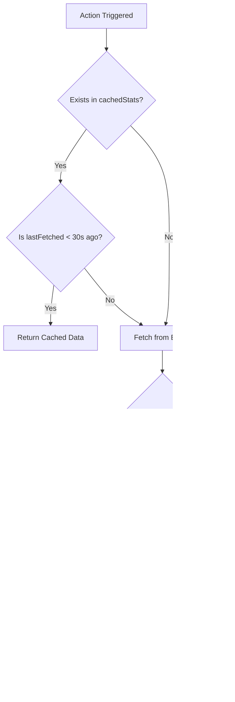

# Caching Strategy: Team Stats

This document outlines the strategy for caching game statistics to prevent rate-limiting and enable automated event detection (e.g., bot messages for goals).

## Current Problem
- Every user on a match page calls the `fetchGameStats` Convex action every 60 seconds.
- Each action call results in a direct fetch to the ESPN API.
- 1,000 users watching a game = 1,000 requests per minute to ESPN from the same Convex backend IP addresses.

## Proposed Solution: Server-Side Cache-Aside with Event Detection
Introduce a `cachedStats` table in Convex and a cache-aware action to manage fetching and stat comparison.

### 1. Schema Update
Add a new table to [`convex/schema.ts`](convex/schema.ts) to persist the stats.

```typescript
// convex/schema.ts

cachedStats: defineTable({
  externalId: v.string(),
  stats: v.any(), // The { home: Record<string, string>, away: Record<string, string> } stats object
  lastFetched: v.number(), // Timestamp of last successful fetch
})
  .index("by_externalId", ["externalId"]),
```

### 2. Event Detection (Bot Messages)
By comparing the *newly fetched* data with the *old* data in `cachedStats` BEFORE updating, we can detect significant events.

#### Detection Logic
When the action fetches fresh data from ESPN, it will:
1.  Query the current record in `cachedStats`.
2.  Compare specific fields (e.g., `goals`, `touchdowns`, `behinds`).
3.  If a field has increased, trigger an `internalMutation` to post a bot message to the `messages` table.

### 3. Updated Action Workflow



### 4. Implementation Spec (Technical)

#### A. Internal Mutation: `saveStatsAndDetectChanges`
Instead of a simple save, this mutation will handle the "intelligence":

```typescript
export const saveStatsAndDetectChanges = internalMutation({
  args: { externalId: v.string(), newStats: v.any(), gameId: v.string() },
  handler: async (ctx, { externalId, newStats, gameId }) => {
    const existing = await ctx.db.query("cachedStats")
      .withIndex("by_externalId", (q) => q.eq("externalId", externalId))
      .unique();

    if (existing) {
      const oldStats = existing.stats;
      
      // Example: Detect Goals
      const oldHomeGoals = parseInt(oldStats.home.goals || "0");
      const newHomeGoals = parseInt(newStats.home.goals || "0");
      
      if (newHomeGoals > oldHomeGoals) {
        // Trigger bot message!
        await ctx.db.insert("messages", {
          gameId,
          content: "⚽ GOAL! Home team has scored!",
          username: "MatchBot",
          type: "text",
          // ... other required fields
        });
      }

      await ctx.db.patch(existing._id, { stats: newStats, lastFetched: Date.now() });
    } else {
      await ctx.db.insert("cachedStats", { externalId, stats: newStats, lastFetched: Date.now() });
    }
  }
});
```

## Benefits
- **Zero Rate Limiting**: Max 1 API request per game per 30s, regardless of user count.
- **Automated Engagement**: Enables real-time bot announcements in the chat based on stat changes.
- **Query Efficiency**: Even though `v.any()` is used, we only read/compare when the *action* fetches, keeping the overhead low.
- **Flexibility**: We can add new detection rules (e.g., "Yellow Card!", "Red Card!") simply by adding new if-statements in the internal mutation.
