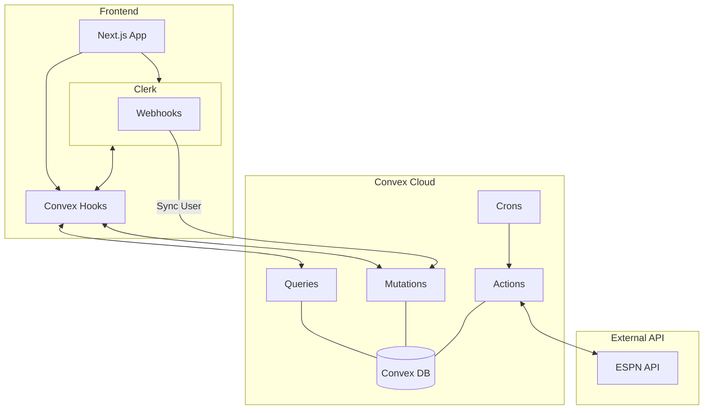

# Full Convex & Clerk Migration Plan - Gamebloc

This document outlines the comprehensive plan to migrate Gamebloc from MongoDB/WebSockets to Convex and Clerk.

## 1. Schema Definition (`convex/schema.ts`)

Convex will handle all data storage, including user profiles, messages, and cached game data.

```typescript
import { defineSchema, defineTable } from "convex/server";
import { v } from "convex/values";

export default defineSchema({
  users: defineTable({
    clerkId: v.string(), // Clerk's user ID
    username: v.optional(v.string()),
    email: v.string(),
    image: v.optional(v.string()),
    bio: v.optional(v.string()),
    favoriteTeams: v.optional(v.array(v.object({
      teamId: v.string(),
      name: v.string(),
      shortName: v.string(),
      logo: v.string(),
      sport: v.string(),
    }))),
    hiddenActivityTeams: v.optional(v.array(v.string())),
  }).index("by_clerkId", ["clerkId"])
    .index("by_username", ["username"]),

  messages: defineTable({
    gameId: v.string(),
    userId: v.id("users"),
    username: v.string(),
    userAvatar: v.optional(v.string()),
    content: v.string(),
    type: v.union(v.literal("text"), v.literal("reaction")),
    replyTo: v.optional(v.object({
      _id: v.string(),
      content: v.string(),
      username: v.string(),
    })),
  }).index("by_gameId", ["gameId"]),

  cachedGames: defineTable({
    externalId: v.string(),
    sport: v.string(),
    leagueId: v.string(),
    data: v.any(),
    lastFetched: v.number(),
  }).index("by_externalId", ["externalId"])
    .index("by_sport_league", ["sport", "leagueId"]),

  conversations: defineTable({
    key: v.string(), // Sorted userId1_userId2
    participants: v.array(v.id("users")),
    lastMessage: v.optional(v.string()),
    lastMessageAt: v.number(),
    lastSenderId: v.optional(v.id("users")),
  }).index("by_key", ["key"])
    .index("by_lastMessageAt", ["lastMessageAt"]),

  dmMessages: defineTable({
    conversationId: v.id("conversations"),
    senderId: v.id("users"),
    senderUsername: v.string(),
    senderAvatar: v.optional(v.string()),
    content: v.string(),
    replyTo: v.optional(v.object({
      _id: v.string(),
      content: v.string(),
      username: v.string(),
    })),
    readBy: v.array(v.id("users")),
  }).index("by_conversationId", ["conversationId"]),

  presence: defineTable({
    userId: v.id("users"),
    gameId: v.optional(v.string()),
    lastSeen: v.number(),
    isTyping: v.optional(v.boolean()),
  }).index("by_gameId", ["gameId"])
    .index("by_userId", ["userId"]),
});
```

## 2. Authentication (Clerk)

*   **Setup:** Replace NextAuth with `@clerk/nextjs`.
*   **Sign-In/Up:** Replace `src/app/auth/page.tsx` and `AuthModal.tsx` with Clerk's components.
*   **Webhook Sync:** Implement a Clerk Webhook to sync user data to the Convex `users` table. This ensures our Convex functions can access user data without making external calls to Clerk every time.

## 3. API & Logic Migration

### Game Data & Stats
*   **`convex/sportsApi.ts` (Action):** Port `fetchAllGames` and `fetchGameStats` logic.
*   **`convex/games.ts` (Mutation):** `syncGames` to update the `cachedGames` table.
*   **`convex/crons.ts`:** Schedule `syncGames` every minute.

### Chat & Messaging
*   **`convex/messages.ts`:** Implement `list`, `send`, `react` for game rooms.
*   **`convex/conversations.ts`:** Implement `list`, `getOrCreate`.
*   **`convex/dmMessages.ts`:** Implement `list`, `send`.

### User Profile
*   **`convex/users.ts`:**
    *   `getMe`: Fetches the current user profile.
    *   `updateProfile`: Handles bio, username, and favorite teams updates.
    *   `getTeamActivity`: Port the logic from `src/app/api/profile/route.ts` that calculates top active teams based on message history.

## 4. Frontend Hooks & State

*   **`src/hooks/useGames.ts`:** Replace with `useQuery(api.games.list)`.
*   **`src/hooks/useSocket.ts`:** **Remove**. Replace with direct Convex mutations and queries in `ChatWindow` and `DMPanel`.
*   **`src/lib/store.ts` (Zustand):**
    *   Simplify `ChatStore` and `DMStore` as most real-time state is now handled by Convex queries.
    *   Keep `GameStore` for UI filters.

## 5. File Deletions

The following files will be removed once the migration is complete:
- `server.js` (No longer need custom server for WebSockets)
- `src/lib/db.ts` (No longer need Mongoose connection)
- `src/lib/models.ts` (No longer need Mongoose models)
- `src/app/api/auth/*` (NextAuth)
- `src/app/api/dm/*`
- `src/app/api/games/*`
- `src/app/api/messages/*`
- `src/app/api/profile/change-email/route.ts` (Clerk handles this)
- `src/app/api/profile/change-password/route.ts` (Clerk handles this)
- `src/app/api/profile/request-otp/route.ts` (Clerk handles this)
- `src/app/api/stats/*`

## 6. Type Updates

*   `src/types/index.ts`: Update `User` and `Message` interfaces to match Convex table structures and `Id` types.

---

## Mermaid Diagram


