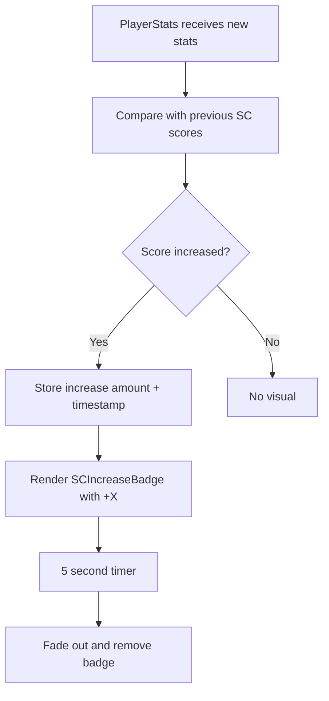

# Plan: Supercoach Score Increase Visual Indicator

## Overview
When player stats are updated on the match page, show a green "+X" text bubble next to the SC score for AFL players whose Supercoach points increased. The bubble fades out after 5 seconds.

## Architecture

### Data Flow


## Implementation Details

### 1. PlayerStats Component Changes (`src/components/PlayerStats.tsx`)

**State Management:**
- Add a `useRef` to track previous SC scores per player (keyed by player ID)
- Add a `useState` map to track active increases: `Record<string, { increase: number; timestamp: number }>`
- Key format: `${teamIdx}-${playerId}` to uniquely identify players

**Detection Logic:**
- When stats are received/updated, iterate through players
- For each player with an SC score, compare against the stored previous score
- If current > previous, add to the increases map with the difference
- Update the previous scores ref with current values

**Cleanup:**
- Use `useEffect` with `setInterval` to check for expired increases (older than 5 seconds)
- Remove expired entries from the increases state

### 2. SCIncreaseBadge Component (new file: `src/components/SCIncreaseBadge.tsx`)

**Props:**
- `increase: number` - The point increase to display

**Visual Design:**
- Small inline bubble next to the SC score value
- Green background (`bg-green-500/20` or similar)
- Green text (`text-green-400`)
- Rounded pill shape
- Small font size (`text-[10px]`)
- Animation: fade out over 5 seconds using CSS animation or framer-motion

**Implementation:**
```tsx
// Uses CSS animation for simplicity
<div className="inline-flex items-center px-1.5 py-0.5 rounded-full bg-green-500/20 text-green-400 text-[10px] font-bold animate-fade-out">
  +{increase}
</div>
```

### 3. CSS Animation (`src/app/globals.css`)

Add a keyframe animation for the fade-out effect:
```css
@keyframes fadeOut {
  0%, 80% { opacity: 1; transform: scale(1); }
  100% { opacity: 0; transform: scale(0.8); }
}

.animate-fade-out {
  animation: fadeOut 5s ease-out forwards;
}
```

### 4. Integration in PlayerStats Table

In the SC column cell (line ~268 in PlayerStats.tsx):
```tsx
<td key="sc" className="...">
  <div className="flex items-center justify-center gap-1">
    {getStatValue(player, "sc")}
    {isAfl && scIncreases[`${teamIdx}-${player.id}`] && (
      <SCIncreaseBadge increase={scIncreases[`${teamIdx}-${player.id}`].increase} />
    )}
  </div>
</td>
```

## Files to Modify

1. **`src/components/PlayerStats.tsx`** - Add state tracking, detection logic, and badge rendering
2. **`src/components/SCIncreaseBadge.tsx`** - New component for the visual badge
3. **`src/app/globals.css`** - Add fade-out animation keyframes

## Edge Cases

- **First load:** No previous scores to compare, so no badges shown initially
- **Score decrease:** Only show for increases (SC scores shouldn't decrease in AFL, but handle gracefully)
- **Player not in previous data:** Treat as 0 previous score
- **Multiple rapid updates:** Each update triggers a new 5-second timer for that player
- **Non-AFL sports:** Badge only renders for AFL matches
