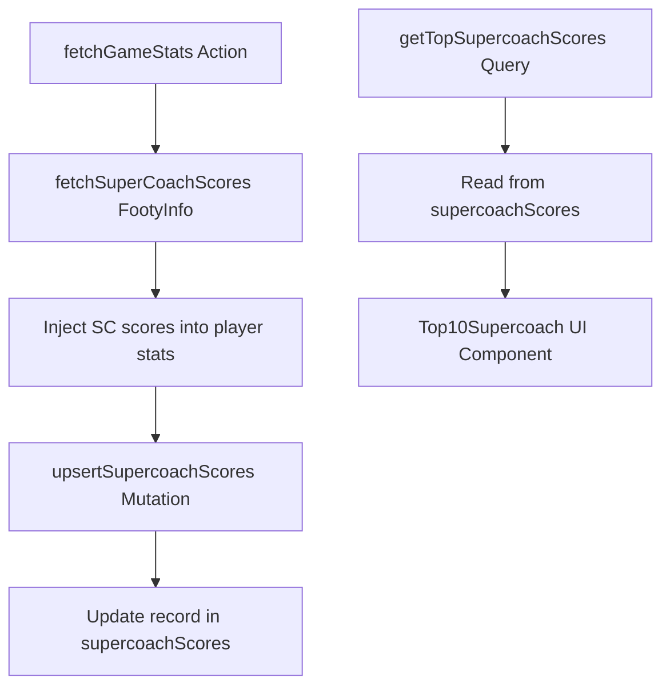

# Plan: Supercoach Scores Leaderboard & Tracking (Optimized)

This plan outlines a highly efficient and searchable approach for tracking Supercoach scores per match, allowing for a rich "Top 10" experience and future analytics.

## Goals
- Track the latest/final Supercoach score for every player in every match.
- Use a searchable, indexed table for instantaneous "Top 10" queries across all matches.
- Include rich metadata for future filtering (by team, round, or opponent).
- Backfill historical data from existing caches.

## Technical Details

### Phase 1. Enhanced Database Schema
The `supercoachScores` table in `convex/schema.ts` will store one record per player per match, enriched with metadata.

```typescript
  supercoachScores: defineTable({
    playerId: v.string(),          // Normalized player name or ID
    playerName: v.string(),        // Display name
    playerImage: v.optional(v.string()), 
    externalMatchId: v.string(),   // ESPN match ID (e.g. "401646704")
    gameId: v.optional(v.string()),  // Convex internal ID (e.g. "afl_401646704")
    score: v.number(),             // Latest/Final Supercoach score
    round: v.optional(v.number()), // Round number
    roundName: v.optional(v.string()), 
    teamId: v.string(),            // Player's team ID
    teamName: v.string(),          // Player's team name
    opponentId: v.optional(v.string()), 
    opponentName: v.optional(v.string()),
    timestamp: v.number(),         // Last updated timestamp
  })
    .index("by_match_player", ["externalMatchId", "playerId"])
    .index("by_score", ["score"])             // For global Top 10
    .index("by_team_score", ["teamId", "score"]) // For Team Top 10
    .index("by_round_score", ["round", "score"]) // For Round Top 10
    .index("by_player", ["playerId", "timestamp"]); // For Player history
```

### Phase 2. Live Update Logic (`convex/stats.ts`)
- Implement `upsertSupercoachScores` mutation.
- This mutation will "upsert" (insert or update) records for players in a match.
- By updating the same record as the game progresses, we maintain a small footprint while keeping the "Top 10" live.

### Phase 3. Interactive UI

#### A. Game Page Integration (`src/app/match/[id]/page.tsx`)
- **Location**: This visual will be added just above the **"Match Statistics"** section.
- **Live Reordering**: Using `framer-motion`, the list will smoothly rearrange itself during live games as players climb the leaderboard based on live scores.
- **Rich Visualization**: High-impact visual displaying player cards with team logos, names, and current Supercoach scores.
- **Dynamic Filtering**: Allows users to filter players within the match context (e.g., by team or scoring tiers).

#### B. Home Page Leaderboard (`src/app/page.tsx`)
- **Component**: `src/components/Top10Supercoach.tsx`.
- **Top 10 Round Scores**: Displays the top 10 Supercoach scores for the currently selected round.
- **Contextual Updates**: The leaderboard automatically updates its data based on the round selected by the **Round Filter** on the home page.
- **Query**: Uses `getTopSupercoachScores` with a filter for the active round.

### Phase 4. Future Ideas (Enabled by this Schema)
- **Team of the Week**: Automatically generate the highest-scoring 22 players from the current round.
- **Player Stats Page**: Show a chart of a player's Supercoach performance over the season.
- **Rivalry Stats**: See which players consistently score highest against certain opponents.

## Workflow

