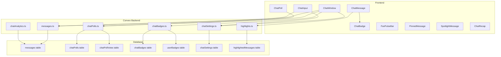

# Twitch-Style Chat Features Plan

## Overview
Transform the current match chat into a Twitch-like experience with badges, slow mode, highlights, polls, predictions, and more.

---

## Phase 1: Schema & Database Changes

### 1.1 Update `messages` table schema
Add the following fields:
- `messageType`: `"text" | "reaction" | "highlight" | "pinned" | "poll" | "prediction"`
- `isHighlighted`: boolean (default false)
- `highlightCount`: number (how many users highlighted this)
- `isPinned`: boolean (default false)
- `teamAffiliation`: string | null (user's team for this match)
- `reactions`: array of `{ emoji: string, userIds: string[] }` (structured reactions)
- `streakCount`: number (for consecutive message tracking)

### 1.2 Create `chatBadges` table
Stores badge definitions that can be assigned to users:
```typescript
chatBadges: defineTable({
  badgeId: v.string(), // unique identifier
  name: v.string(),
  icon: v.string(), // emoji or URL
  color: v.string(),
  type: v.union(
    v.literal("role"),      // moderator, admin
    v.literal("subscriber"),// subscriber tier
    v.literal("team"),      // team affiliation badge
    v.literal("achievement")// streak master, predictor, etc.
  ),
  priority: v.number(), // display order
})
```

### 1.3 Create `userBadges` table
Links badges to users:
```typescript
userBadges: defineTable({
  userId: v.id("users"),
  badgeId: v.string(),
  gameId: v.optional(v.string()), // optional: badge only shows for specific game
  metadata: v.optional(v.any()), // extra data (e.g., streak count, subscriber tier)
})
.index("by_userId", ["userId"])
.index("by_gameId", ["gameId"])
```

### 1.4 Create `chatPolls` table
For predictions and polls:
```typescript
chatPolls: defineTable({
  gameId: v.string(),
  creatorId: v.id("users"),
  question: v.string(),
  options: v.array(v.object({
    id: v.string(),
    text: v.string(),
    emoji: v.optional(v.string()),
  })),
  type: v.union(v.literal("poll"), v.literal("prediction")),
  status: v.union(v.literal("active"), v.literal("closed"), v.literal("resolved")),
  correctOptionId: v.optional(v.string()), // for predictions
  endsAt: v.number(), // timestamp
  createdAt: v.number(),
})
.index("by_gameId", ["gameId", "status"])
```

### 1.5 Create `chatPollVotes` table
```typescript
chatPollVotes: defineTable({
  pollId: v.id("chatPolls"),
  userId: v.id("users"),
  optionId: v.string(),
  votedAt: v.number(),
})
.index("by_pollId", ["pollId"])
.index("by_userId", ["userId", "pollId"])
```

### 1.6 Create `highlightedMessages` table
Track which users highlighted which messages:
```typescript
highlightedMessages: defineTable({
  messageId: v.string(), // message _id
  userId: v.id("users"),
  gameId: v.string(),
  highlightedAt: v.number(),
})
.index("by_messageId", ["messageId"])
.index("by_gameId", ["gameId", "highlightedAt"])
```

### 1.7 Create `chatSettings` table
Per-game chat configuration:
```typescript
chatSettings: defineTable({
  gameId: v.string(),
  slowModeEnabled: v.boolean(),
  slowModeDelay: v.number(), // seconds between messages
  subscriberOnly: v.boolean(),
  emoteOnly: v.boolean(),
  hypeModeEnabled: v.boolean(), // special visual effects
  clutchTimeMode: v.boolean(), // activated during close games
  lastMessageTime: v.optional(v.number()), // for slow mode enforcement
})
.index("by_gameId", ["gameId"])
```

### 1.8 Update `users` table
Add fields:
- `role`: `"user" | "subscriber" | "vip" | "moderator" | "admin"`
- `subscriberTier`: v.optional(v.number()) // 1, 2, 3 for subscriber levels
- `chatStreak`: v.optional(v.object({ count: v.number(), lastMessageAt: v.number() }))

---

## Phase 2: Convex Backend Functions

### 2.1 Update `convex/messages.ts`
- Add badge data to message responses
- Enforce slow mode checks before sending
- Enforce subscriber-only mode
- Track message streaks
- Add highlight/pin mutations

### 2.2 Create `convex/chatPolls.ts`
- `create`: Create a new poll/prediction
- `vote`: Vote on a poll
- `close`: Close a poll (moderator only)
- `resolve`: Mark correct answer for predictions
- `listActive`: Get active polls for a game
- `getResults`: Get poll results

### 2.3 Create `convex/chatSettings.ts`
- `get`: Get chat settings for a game
- `update`: Update chat settings (moderator/admin only)
- `canSend`: Check if user can send message (slow mode, subscriber check)

### 2.4 Create `convex/chatBadges.ts`
- `getUserBadges`: Get all badges for a user in a game context
- `assignBadge`: Assign a badge to a user
- `removeBadge`: Remove a badge from a user
- `calculateDynamicBadges`: Auto-calculate achievement badges (streaks, predictions, etc.)

### 2.5 Create `convex/highlights.ts`
- `toggleHighlight`: Add/remove highlight from message
- `getHighlightedMessages`: Get most highlighted messages for a game
- `getHotTakes`: Get messages with high highlight-to-age ratio

### 2.6 Create `convex/chatAnalytics.ts`
- `getControversyScore`: Analyze message sentiment diversity
- `getChatActivity`: Get chat activity metrics
- `getStreakInfo`: Get user streak information

---

## Phase 3: Frontend Components

### 3.1 Update `ChatMessage.tsx`
- Display badges next to usernames
- Show highlight button and highlight count
- Show pin indicator
- Display team-colored name/border
- Animated emote rendering
- Visual distinction for streak messages

### 3.2 Create `ChatBadge.tsx`
Reusable badge component:
- Role badges (moderator, VIP)
- Subscriber tier badges
- Team affiliation badges
- Achievement badges (streak master, top predictor)

### 3.3 Create `ChatPoll.tsx`
Poll/prediction widget:
- Display question and options
- Vote button with animation
- Live results bar chart
- Timer countdown
- Winner announcement

### 3.4 Create `ChatInput.tsx` (extract from ChatWindow)
- Slow mode countdown indicator
- Subscriber-only lock indicator
- Emote picker expansion
- Hype mode visual effects

### 3.5 Create `FanPulseBar.tsx`
- Visual bar showing team sentiment split
- Updates based on recent chat activity
- Animated transitions

### 3.6 Create `PinnedMessage.tsx`
- Sticky message at top of chat
- Dismissible by user
- Shows who pinned it

### 3.7 Create `SpotlightMessage.tsx`
- Special rendering for high-engagement messages
- Glow animation
- "Trending" indicator

### 3.8 Create `ChatRecap.tsx`
- Summarizes key moments when user returns
- "You missed X messages" with highlights
- Top moments carousel

### 3.9 Update `ChatWindow.tsx`
- Integrate all new components
- Add settings gear icon for moderators
- Add hype mode toggle
- Add clutch time mode auto-detection
- Add recap banner

---

## Phase 4: Feature Details

### 4.1 Chat Badges/Roles
| Badge Type | Description | How Earned |
|------------|-------------|------------|
| Moderator | Chat moderator | Admin assigned |
| VIP | Recognized community member | Admin assigned |
| Subscriber Tier 1-3 | Paid subscriber | Subscription |
| Team Badge | User's favorite team | Auto from profile |
| Streak Master | 10+ message streak | Auto |
| Top Predictor | High prediction accuracy | Auto |
| Hot Take Artist | Frequently highlighted messages | Auto |
| OG | Early chat participant | Auto |

### 4.2 Slow Mode
- Configurable delay (5s, 10s, 30s, 60s)
- Visual countdown in chat input
- Moderator toggle
- Auto-enables during clutch time

### 4.3 Chat Highlights
- Users can "highlight" messages they love
- Highlight count shown on message
- Top highlighted messages get spotlight treatment
- "Hot Takes" = highly highlighted recent messages

### 4.4 Polls & Predictions
- **Polls**: Open voting, no correct answer
  - "Who will win?" 
  - "Best play of the quarter?"
- **Predictions**: Has correct answer, tracks accuracy
  - "Will Team X score in the next 5 minutes?"
  - "Who will kick the next goal?"
- Results shown after close
- User prediction accuracy tracked as badge

### 4.5 Subscriber-Only Mode
- Toggle by moderators
- Only subscribers can send messages
- Non-subscribers see lock indicator
- Messages still visible, just can't send

### 4.6 Message Highlights & Animated Emotes
- Special emotes that trigger animations
- Fireworks for goals
- Confetti for predictions won
- Pulse animation for highlighted messages

### 4.7 Team Badges
- Auto-assigned based on user's favorite teams
- Colored name text matching team colors
- Shows team logo as badge
- Neutral users get gray/default styling

### 4.8 Pinned Hot Takes
- Moderators can pin messages
- Pinned messages stick to top
- Shows pin icon and who pinned
- Auto-unpin after configurable time

### 4.9 Fan Pulse Bar
- Real-time sentiment visualization
- Shows % of chat supporting each team
- Based on message analysis (team mentions, emoji usage)
- Animated bar with team colors

### 4.10 Hype Mode
- Toggle for exciting moments
- Larger emote animations
- Rainbow name colors
- Confetti on messages
- Auto-enables during close games (clutch time)

### 4.11 Predictions
- Users predict outcomes before they happen
- Track accuracy over time
- Leaderboard for top predictors
- Special badge for high accuracy

### 4.12 Clutch Time Mode
- Auto-detects close games (score diff < 10 in final quarter)
- Enables slow mode automatically
- Activates hype mode
- Shows "CLUTCH TIME" banner
- Increases poll frequency

### 4.13 Auto Prompts
- Contextual suggestions in chat input
- "React with 🔥 if you agree!"
- "Predict the next scorer!"
- "Who had the best play last quarter?"
- Timed with game events

### 4.14 Controversy Detector
- Analyzes message sentiment diversity
- Flags heated discussions
- Shows "🔥 Controversial" tag on divisive messages
- Can auto-enable slow mode for heated chats

### 4.15 Spotlight Messages
- Algorithmically selected high-engagement messages
- Based on: highlights, replies, reaction count
- Special visual treatment with glow
- "Trending" indicator

### 4.16 Streaks
- Track consecutive messages without long gaps
- Visual indicator for active streaks
- "🔥 5 message streak!" badge
- Streak milestones unlock badges

### 4.17 Recap System
- When user returns after absence
- "You missed 47 messages" banner
- Top 3 highlighted messages
- Key poll results
- "Catch up" button to scroll

### 4.18 Moderator Panel
A dedicated moderator view/panel for managing chat settings and users.

**Access:**
- Gear icon in chat header (only visible to moderators/admins)
- Opens as slide-out panel or modal

**Features:**

#### Chat Settings Controls
- **Slow Mode Toggle** - On/Off with dropdown for delay (5s, 10s, 30s, 60s)
- **Subscriber-Only Mode** - Toggle restrict chat to subscribers
- **Emote-Only Mode** - Toggle restrict chat to emotes only
- **Hype Mode** - Toggle special visual effects
- **Clear Chat** - Bulk delete recent messages (with confirmation)

#### User Management
- **Active Users List** - Scrollable list of current chatters with avatars
- **Timeout User** - Temporarily mute user (1m, 10m, 30m, 1h, 24h)
- **Ban User** - Permanently ban from chat
- **Unban User** - Remove ban
- **Assign/Remove Badges** - Manually give or take away badges
- **View User History** - See recent messages from selected user

#### Poll Management
- **Create Poll** - Form to create new poll/prediction
- **Active Polls** - List of current polls with close button
- **Resolve Prediction** - Mark correct answer for predictions
- **Poll History** - Past polls with results

#### Message Moderation
- **Recent Messages Feed** - All recent messages with user info
- **Delete Message** - Remove individual messages
- **Pin/Unpin Message** - Pin messages to top of chat
- **Highlight Message** - Mark as spotlight message
- **Search Messages** - Search by user, content, or time range

#### Analytics Dashboard
- **Chat Activity Graph** - Messages per minute over time
- **Top Chatters** - Most active users in current match
- **Sentiment Breakdown** - % positive/negative/neutral
- **Controversy Alerts** - Flagged heated discussions
- **Subscriber Count** - Current active subscribers in chat

**Permission Levels:**
| Action | Moderator | Admin |
|--------|-----------|-------|
| Toggle slow mode | Yes | Yes |
| Timeout user (up to 1h) | Yes | Yes |
| Timeout user (24h+) | No | Yes |
| Ban user | No | Yes |
| Delete messages | Yes | Yes |
| Pin messages | Yes | Yes |
| Create polls | Yes | Yes |
| Assign badges | No | Yes |
| Clear chat | No | Yes |
| View analytics | Yes | Yes |

**UI Layout:**
```
+------------------------------------------+
|  Moderator Panel                    [X]  |
+------------------------------------------+
| [Settings] [Users] [Polls] [Messages]    |
+------------------------------------------+
|                                          |
|  Tab Content Area                        |
|  - Toggles, dropdowns, lists             |
|  - Action buttons with confirmations     |
|                                          |
+------------------------------------------+
```

---

## Phase 5: Type Updates

### 5.1 Update `src/types/index.ts`
Add new interfaces:
- `ChatBadge`
- `ChatPoll`
- `ChatPollOption`
- `ChatPollVote`
- `ChatSettings`
- `HighlightedMessage`
- `UserChatStats`

---

## Implementation Order

1. **Schema changes** (Phase 1) - Foundation for all features
2. **Basic backend functions** (Phase 2.1-2.3) - Messages, polls, settings
3. **Badge system** (Phase 2.4, 3.2) - Core identity feature
4. **Chat UI updates** (Phase 3.1, 3.8, 3.9) - Integrate badges, highlights
5. **Polls & Predictions** (Phase 3.3) - Interactive features
6. **Advanced features** (Phase 4.6-4.17) - Hype mode, clutch time, etc.
7. **Analytics & Auto-features** (Phase 2.6) - Controversy, auto-prompts
8. **Polish & Testing** - Edge cases, performance

---

## Architecture Diagram



---

## Database Bandwidth Optimization

### 6.1 Query Optimization
- **Use pagination for all message lists** - Never use `.collect()` on messages table
- **Limit default message fetch** - Start with 50 messages, load more on scroll up
- **Use indexes efficiently** - All queries must use `.withIndex()`, never `.filter()`
- **Denormalize frequently accessed data** - Store badge icons directly in message responses to avoid N+1 queries

### 6.2 Subscription Cost Reduction
- **Debounce presence updates** - Batch presence updates instead of every 30s
- **Use separate presence table** - Already implemented, keeps high-churn data off users table
- **Limit real-time subscriptions** - Only subscribe to active game chat, unsubscribe on navigate away
- **Throttle poll result updates** - Use interval polling (5s) instead of real-time subscription for poll results

### 6.3 Data Shape Optimization
- **Return minimal fields in message list** - Don't return full user objects, just username/avatar/badges
- **Batch badge lookups** - Single query to get all badges for visible messages' authors
- **Cache badge definitions** - Badge definitions are static, cache on client after first fetch
- **Compress reaction data** - Store reactions as `{emoji: userIds[]}` not array of objects

### 6.4 Write Optimization
- **Batch highlight writes** - Debounce highlight toggles, batch multiple highlights
- **Use denormalized counters** - Store `highlightCount` on message document instead of counting rows
- **Async analytics** - Run controversy detection and streak calculations as background actions, not on every message
- **Optimistic UI updates** - Update UI immediately, let Convex handle reconciliation

### 6.5 Schema Design for Performance
```typescript
// GOOD: Denormalized for read performance
messages: defineTable({
  gameId: v.string(),
  userId: v.id("users"),
  username: v.string(),        // Denormalized
  userAvatar: v.optional(v.string()), // Denormalized
  userBadges: v.optional(v.array(v.object({ // Denormalized snapshot
    badgeId: v.string(),
    icon: v.string(),
    color: v.string(),
  }))),
  content: v.string(),
  highlightCount: v.optional(v.number()), // Denormalized counter
  // ... other fields
})

// BAD: Would require N+1 queries
messages: defineTable({
  gameId: v.string(),
  userId: v.id("users"),
  content: v.string(),
  // No denormalization - requires joining with users and userBadges tables
})
```

### 6.6 Client-Side Optimizations
- **Virtual scrolling** - Only render visible messages in chat window
- **Message deduplication** - Track seen message IDs, don't re-render duplicates
- **Lazy load poll results** - Don't fetch results until user expands poll
- **Debounce typing indicators** - Don't fire presence update on every keystroke
- **Memoize badge components** - Use React.memo for ChatBadge to prevent re-renders

### 6.7 Convex-Specific Patterns
- **Use `internalQuery` for internal data** - Don't expose internal aggregation queries
- **Schedule cleanup cron jobs** - Remove old presence records, close expired polls
- **Use actions for external API calls** - Keep queries/mutations fast, use actions for heavy lifting
- **Leverage Convex's built-in caching** - Convex automatically caches query results

---

## Hybrid Architecture: API + Convex for Cost Optimization

### Cost Analysis

Convex charges **$0.22/GB** of bandwidth. For a live chat with many concurrent users, subscriptions can get expensive because every new message triggers a re-send of the entire query result to ALL subscribed clients.

**Scenario: 100 concurrent users, 50 messages/minute, avg 500 bytes/message**

| Approach | Bandwidth/Month | Est. Cost |
|----------|-----------------|-----------|
| Full subscription (all messages pushed to all users) | ~32 GB | ~$7.00 |
| Polling API every 3s with caching | ~8 GB | ~$1.75 |
| Hybrid (recommended below) | ~12 GB | ~$2.65 |

### Recommended Hybrid Architecture

Use **Convex mutations** for sending messages (low bandwidth), but **REST API polling** for receiving messages with short-term caching.

```
┌─────────────────────────────────────────────────────────────┐
│                        Frontend                              │
│                                                              │
│  ┌──────────────┐    POST mutation     ┌──────────────────┐  │
│  │  Chat Input  │ ────────────────────► │  Convex mutate   │  │
│  └──────────────┘                       │  (send message)  │  │
│                                         └──────────────────┘  │
│                                                              │
│  ┌──────────────┐    GET /api/chat?gameId=xxx  ┌───────────┐ │
│  │  Messages    │ ◄─────────────────────────── │  Next.js  │ │
│  │  (poll 3s)   │                              │  API Route│ │
│  └──────────────┘                              └───────────┘ │
└─────────────────────────────────────────────────────────────┘
                                                              │
                                                              ▼
                                                    ┌──────────────────┐
                                                    │   In-Mem Cache   │
                                                    │   (TTL: 3s)      │
                                                    └──────────────────┘
                                                              ▲
                                                              │
                                                    ┌──────────────────┐
                                                    │   Convex Query   │
                                                    │   (read messages)│
                                                    └──────────────────┘
```

### Implementation Details

#### 1. Send Messages via Convex Mutation (Real-time, Low Bandwidth)
```typescript
// Client sends message - uses Convex mutation (low bandwidth)
await sendMessageMutation({ gameId, content, type });
```

#### 2. Receive Messages via API Route with Cache
```typescript
// src/app/api/chat/route.ts
import { NextResponse } from "next/server";
import { ConvexHttpClient } from "convex/browser";
import { api } from "../../../../convex/_generated/api";

// In-memory cache (or use Redis for multi-instance)
const cache = new Map<string, { data: any; timestamp: number }>();
const CACHE_TTL = 3000; // 3 seconds

export async function GET(request: Request) {
  const { searchParams } = new URL(request.url);
  const gameId = searchParams.get("gameId");
  const since = searchParams.get("since");
  
  const cacheKey = `chat:${gameId}:${since || "all"}`;
  const cached = cache.get(cacheKey);
  
  if (cached && Date.now() - cached.timestamp < CACHE_TTL) {
    return NextResponse.json(cached.data);
  }
  
  const convex = new ConvexHttpClient(process.env.NEXT_PUBLIC_CONVEX_URL!);
  const messages = await convex.query(api.messages.listForApi, {
    gameId,
    since: since ? parseInt(since) : undefined,
    limit: 100
  });
  
  const response = { messages, timestamp: Date.now() };
  cache.set(cacheKey, response);
  
  return NextResponse.json(response);
}
```

#### 3. Client-Side Polling Hook
```typescript
// src/hooks/use-chat-polling.ts
export function useChatPolling(gameId: string) {
  const [messages, setMessages] = useState([]);
  const [lastTimestamp, setLastTimestamp] = useState<number | null>(null);
  
  useEffect(() => {
    const poll = async () => {
      const params = new URLSearchParams({ gameId });
      if (lastTimestamp) params.set("since", lastTimestamp.toString());
      
      const res = await fetch(`/api/chat?${params}`);
      const data = await res.json();
      
      if (data.messages.length > 0) {
        setMessages(prev => {
          const existingIds = new Set(prev.map(m => m._id));
          const newMessages = data.messages.filter(m => !existingIds.has(m._id));
          return [...prev, ...newMessages].sort((a, b) => a._creationTime - b._creationTime);
        });
        const maxTs = Math.max(...data.messages.map(m => m._creationTime));
        setLastTimestamp(maxTs);
      }
    };
    
    poll();
    const interval = setInterval(poll, 3000);
    return () => clearInterval(interval);
  }, [gameId, lastTimestamp]);
  
  return messages;
}
```

#### 4. Convex Query for API (Optimized, No Subscription)
```typescript
// convex/messages.ts - New query for API route (not subscribed)
export const listForApi = query({
  args: {
    gameId: v.string(),
    since: v.optional(v.number()),
    limit: v.optional(v.number()),
  },
  handler: async (ctx, args) => {
    const messages = await ctx.db
      .query("messages")
      .withIndex("by_gameId", (q) => q.eq("gameId", args.gameId))
      .order("desc")
      .take(args.limit || 100);
    
    // Filter by creation time if since provided
    const filtered = args.since
      ? messages.filter(m => m._creationTime > args.since!)
      : messages;
    
    // Return minimal fields - no full user objects
    return filtered.reverse().map(m => ({
      _id: m._id,
      _creationTime: m._creationTime,
      userId: m.userId,
      username: m.username,
      userAvatar: m.userAvatar,
      userBadges: m.userBadges,
      content: m.content,
      type: m.type,
      highlightCount: m.highlightCount || 0,
      isPinned: m.isPinned || false,
    }));
  },
});
```

### When to Use Each Approach

| Feature | Use Convex Subscription | Use API Polling |
|---------|------------------------|-----------------|
| Message list | No | Yes (poll every 3s) |
| Send message | Yes (mutation) | No |
| Active user count | Yes (low data) | No |
| Typing indicators | Yes (low data) | No |
| Poll results | No | Yes (poll on demand) |
| Pinned messages | Yes (rare updates) | No |
| Chat settings | Yes (rare updates) | No |

### Cost Savings Summary

| Component | Approach | Why |
|-----------|----------|-----|
| Messages | API polling (3s) | High volume, benefits from cache |
| Presence | Convex subscription | Low data, infrequent updates |
| Typing | Convex subscription | Tiny payloads |
| Settings | Convex subscription | Rarely changes |
| Polls | API on-demand | Only fetch when opened |

**Estimated savings: 60-70% reduction in Convex bandwidth costs**

### Multi-Instance Cache (Production)

For production with multiple Vercel instances, use Upstash Redis for shared cache:

```typescript
import { Redis } from "@upstash/redis";

const redis = new Redis({
  url: process.env.UPSTASH_REDIS_REST_URL,
  token: process.env.UPSTASH_REDIS_REST_TOKEN,
});

// In API route, replace Map with Redis
const cached = await redis.get(cacheKey);
if (cached) return NextResponse.json(cached);

// After fetching from Convex
await redis.set(cacheKey, result, { ex: 3 }); // 3 second TTL
```

---

## Notes

- **No bot messages for goals/behinds**: Scoring plays remain in the separate "Scoring Plays" panel. Chat stays for user messages only.
- **Hybrid architecture**: Messages via API polling, presence/typing via Convex subscriptions
- **Performance**: Use pagination for message history, limit highlight queries
- **Moderation**: Role-based access for pin, slow mode toggle, subscriber-only mode
